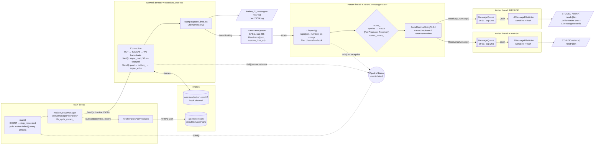
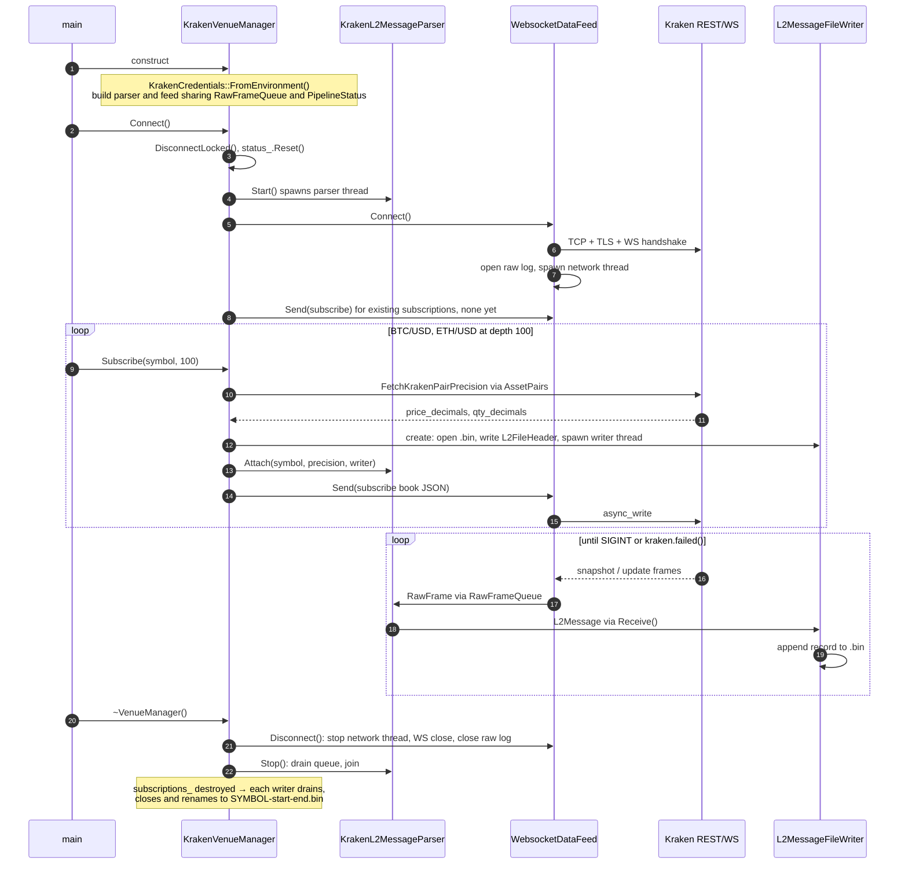

# data_feed architecture

## Data flow across threads

```mermaid
flowchart LR
    subgraph Kraken["Kraken"]
        WS[("wss://ws.kraken.com/v2<br/>book channel")]
        REST[("api.kraken.com<br/>/0/public/AssetPairs")]
    end

    subgraph Main["Main thread"]
        MAIN["main()<br/>SIGINT → stop_requested<br/>polls kraken.failed() every 100 ms"]
        VM["KrakenVenueManager<br/>VenueManager&lt;kKraken&gt;<br/>life_cycle_mutex_"]
        PREC["FetchKrakenPairPrecision"]
    end

    subgraph Net["Network thread: WebsocketDataFeed"]
        CONN["Connection<br/>TCP → TLS SNI → WS handshake<br/>Next(): async_read, 50 ms stop poll<br/>Send(): post → outbox_ → async_write"]
        STAMP["stamp capture_time_ns<br/>UnixNanosNow()"]
    end

    RAWLOG[/"kraken_l2_messages-&lt;ns&gt;.txt<br/>raw JSON log"/]
    RFQ[["RawFrameQueue<br/>SPSC, cap 256<br/>RawFrame{json, capture_time_ns}"]]

    subgraph Parse["Parser thread: KrakenL2MessageParser"]
        DISPATCH["Dispatch()<br/>rapidjson, numbers as strings<br/>filter channel == book"]
        ROUTES{"routes_<br/>symbol → Route<br/>{PairPrecision, Receiver*}<br/>routes_mutex_"}
        SCALE["ScaleDecimalStringToI64<br/>ParseChecksum / ParseVenueTime"]
    end

    subgraph W1["Writer thread: BTC/USD"]
        Q1[["MessageQueue<br/>SPSC, cap 256"]]
        FW1["L2MessageFileWriter<br/>Serialize + flush"]
    end

    subgraph W2["Writer thread: ETH/USD"]
        Q2[["MessageQueue<br/>SPSC, cap 256"]]
        FW2["L2MessageFileWriter<br/>Serialize + flush"]
    end

    BIN1[/"BTCUSD-&lt;start&gt;[-&lt;end&gt;].bin<br/>L2FileHeader 64B + L2Message records"/]
    BIN2[/"ETHUSD-&lt;start&gt;[-&lt;end&gt;].bin"/]

    STATUS(("PipelineStatus<br/>atomic failed"))

    MAIN --> VM
    VM -- "Subscribe(symbol, depth)" --> PREC
    PREC -- "HTTPS GET" --> REST
    VM -- "Send(subscribe JSON)" --> CONN
    CONN <-- "frames" --> WS
    CONN --> STAMP
    STAMP --> RAWLOG
    STAMP -- "PushBlocking" --> RFQ
    RFQ -- "Drain" --> DISPATCH
    DISPATCH --> ROUTES
    ROUTES --> SCALE
    SCALE -- "Receive(L2Message)" --> Q1
    SCALE -- "Receive(L2Message)" --> Q2
    Q1 -- "Drain" --> FW1 --> BIN1
    Q2 -- "Drain" --> FW2 --> BIN2

    CONN -. "Fail() on socket error" .-> STATUS
    DISPATCH -. "Fail() on exception" .-> STATUS
    STATUS -. "failed()" .-> MAIN
```

## Lifecycle: main → Connect → Subscribe → shutdown

```mermaid
sequenceDiagram
    autonumber
    participant M as main
    participant VM as KrakenVenueManager
    participant P as KrakenL2MessageParser
    participant F as WebsocketDataFeed
    participant K as Kraken REST/WS
    participant W as L2MessageFileWriter

    M->>VM: construct
    Note over VM: KrakenCredentials::FromEnvironment()<br/>build parser and feed sharing RawFrameQueue and PipelineStatus

    M->>VM: Connect()
    VM->>VM: DisconnectLocked(), status_.Reset()
    VM->>P: Start() spawns parser thread
    VM->>F: Connect()
    F->>K: TCP + TLS + WS handshake
    F->>F: open raw log, spawn network thread
    VM->>F: Send(subscribe) for existing subscriptions, none yet

    loop BTC/USD, ETH/USD at depth 100
        M->>VM: Subscribe(symbol, 100)
        VM->>K: FetchKrakenPairPrecision via AssetPairs
        K-->>VM: price_decimals, qty_decimals
        VM->>W: create: open .bin, write L2FileHeader, spawn writer thread
        VM->>P: Attach(symbol, precision, writer)
        VM->>F: Send(subscribe book JSON)
        F->>K: async_write
    end

    loop until SIGINT or kraken.failed()
        K-->>F: snapshot / update frames
        F->>P: RawFrame via RawFrameQueue
        P->>W: L2Message via Receive()
        W->>W: append record to .bin
    end

    M->>VM: ~VenueManager()
    VM->>F: Disconnect(): stop network thread, WS close, close raw log
    VM->>P: Stop(): drain queue, join
    Note over VM: subscriptions_ destroyed → each writer drains,<br/>closes and renames to SYMBOL-start-end.bin
```
